# Creando una Red Social

## Índice

* [1. Resumen del proyecto](#1-resumen-del-proyecto)
* [2. Investigación del usuario](#2-investigación-del-usuario)
* [3. Definición del producto](#3-definición-del-producto)
* [4. Historias de usuario](#4-historias-de-usuario)
* [5. Diseño de la Interfaz de Usuario](#5-diseño-de-la-interfaz-de-usuario)
* [6. Consideraciones del comportamiento de la interfaz de usuario](#6-consideraciones-del-comportamiento-de-la-interfaz-de-usuario)
* [7. Pruebas unitarias](#8-pruebas-unitarias)
* [8. Resultado final](#8-resultado-final)

## 1. Resumen del proyecto

En este proyecto se realizó la construcción de una SPA, que tiene como objetivo llegar a las amas de casa y ofrecerles un espacio para interactuar con otras mujeres y compartir consejos, artículos, etc. de contenidos relacionados al bienestar, cocina, limpieza, educación o cualquier información que pueda ser útil para su vida cotidiana en casa. 

## 2. Investigación del usuario

Se realizaron encuestas a amas de casa, por medio de Google forms. Se realizaron 5 preguntas y se obtuvieron 18 respuestas. 
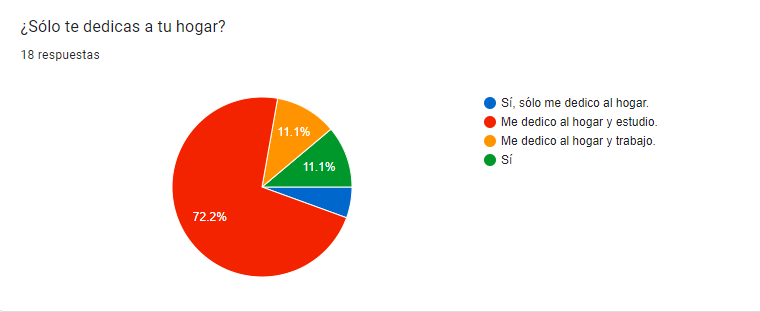
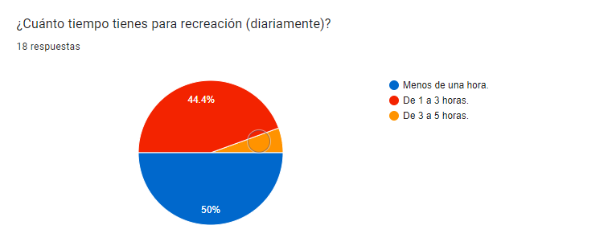
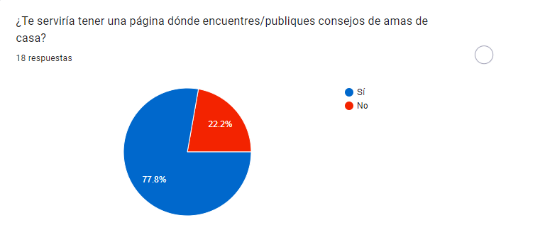
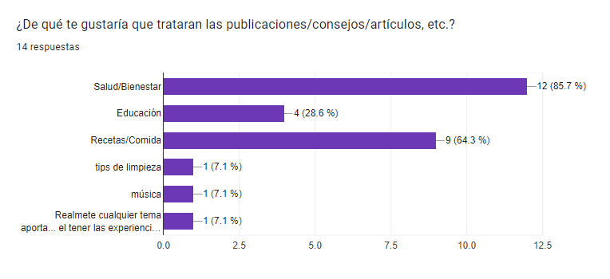
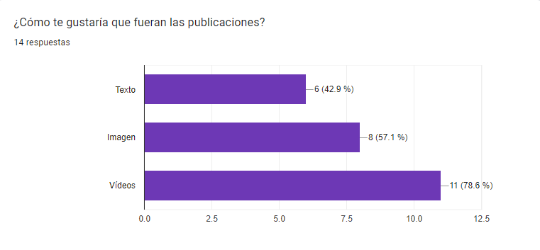

## 3. Definición del producto

La información recaudada en la encuesta nos permitió ver la necesidad de las amas de casa que cuentan con poco tiempo, pero que necesitan de un espacio para encontrar y compartir información que les sea útil en sus actividades. Por ello se crea la red social "Home helpers", que te permite registrarte, iniciar y cerrar sesión, además de compartir publicaciones de texto en tiempo real, editarlas y eliminarlas, e incluso dar like y dislike. De esta manera, las amas de casa tienen un fácil acceso a información que ya está sintetizada, pues proviene de la experiencia de otras amas de casa.

Home helpers es un espacio seguro para cualquier persona que ejerza un papel en su hogar, la comunidad te brinda un acompañamiento sin importar si ya tienes experiencia en el hogar o estás en proceso de adaptarte a este estilo de vida.

## 4. Historias de usuario

**HU1. Registro de usuario.**
Yo cómo: ama de casa.
Quiero: hacer una cuenta en Home helpers.
Para: unirme a la comunidad.

*Criterios de aceptación:*
-Visualizar formulario para registro de usuario.

*Criterios de terminado:*
-Tener input para nombre, correo, fecha de nacimiento y crear contraseña.
- Validar correo electrónico.
-Que no deje campos vacíos.
-Que todos los campos sean en minúsculas.
-Que la contraseña sea de 8 caracteres.
-Tener un botón de Registrarse.
-Que tenga un nombre de usuario único.
-Mostrar errores de creación de usuario.
-Campo de contraseña oculto.
-Que tenga una base de datos en Firebase.
-Mostrar pantalla que valide la creación de cuenta.
-Que se registre el usuario correctamente.
-Que pase los test.

**HU2. Iniciar sesión.**
Yo cómo: usuaria registrada de Home helpers.
Quiero: iniciar sesión en mi cuenta.
Para: acceder a la página y su contenido.

*Criterios de aceptación:*
-Visualizar formulario de inicio de sesión.
–Visualizar inicio de sesión con Google.

*Criterios de terminado:*
-Tener input para correo y contraseña.
-Tener un botón de inicio de sesión.
- Validar correo electrónico.
-Que no deje campos vacíos.
-Que la contraseña sea válida.
-Mostrar errores de inicio de sesión.
-Campo de contraseña oculto.
-Que se inicie sesión correctamente.
-Que pase los test.

**HU 3. Cerrar sesión.**
Yo cómo: usuaria de Home helpers.
Quiero: cerrar mi sesión..
Para: no exponer mi información en el navegador.

*Criterios de aceptación:*
-Visualizar botón para cerrar sesión

*Criterios de terminado:*
-Abrir menú con opciones
-Botón para cerrar sesión.
-Regresar a la página principal.

**HU4. Guardar y mostrar post.**
Yo cómo: Usuaria de HH
Quiero: publicar un post con texto.
Para: compartir información.

*Criterios de aceptación:*
-Visualizar espacio dónde pueda escribir un post y publicarlo.

*Criterios de terminado:*
-Botón para crear publicación.
-Abrir ventana con input de texto.
-Validar que exista contenido.
-Botón para publicar el post.
-Botón de cancelar.
-Visualizar mensaje de publicación finalizada.
-Ver el post en el muro.
-Pasar los test.

**HU5. Editar post.**
Yo cómo: usuaria de home helpers.
Quiero: editar el post que realicé.
Para: mejorar mi publicación.

*Criterios de aceptación:*
-Menú con opción de editar el post.

*Criterios de terminado:*
-Botón de editar post.
-Input con el texto anterior y poder editarlo.
-Botón de guardar los cambios.
-Botón de cancelar.
-Visualizar mensaje de cambios realizados.
-Visualizar el post editado.
-Pasar los test.

**HU6. Eliminar post.**
Yo cómo: usuaria de Home helpers.
Quiero: eliminar una publicación.
Para: quitar información que ya no quiero compartir.

*Criterios de aceptación:*
-Menú con opción de eliminar el post.

*Criterios de terminado:*
-Botón de eliminar publicación.
-Validar si se desea eliminar el post.
-Visualizar mensaje de publicación eliminada.
-Pasar los test.

**HU7. Dar y quitar like.**
Yo cómo: usuaria de Home helpers.
Quiero: dar like a las publicaciones.
Para: mostrar que me agrada el contenido.

*Criterios de aceptación:*
-Botón de dar/quitar like.

*Criterios de terminado:*
-Sólo dar un like por usuaria.
-Mostrar cantidad de likes.
-Pasar los test.

## 5. Diseño Diseño de la Interfaz de Usuario

### 5.1 Prototipo de baja fidelidad

#### Versión móvil

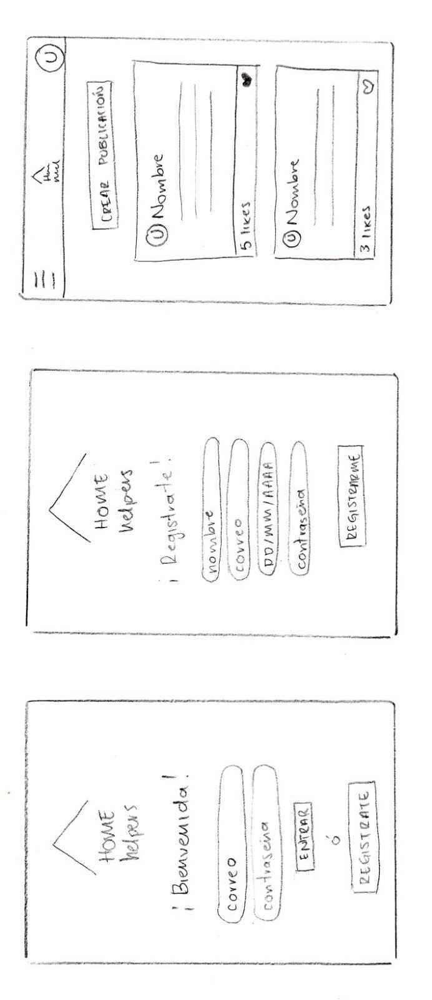
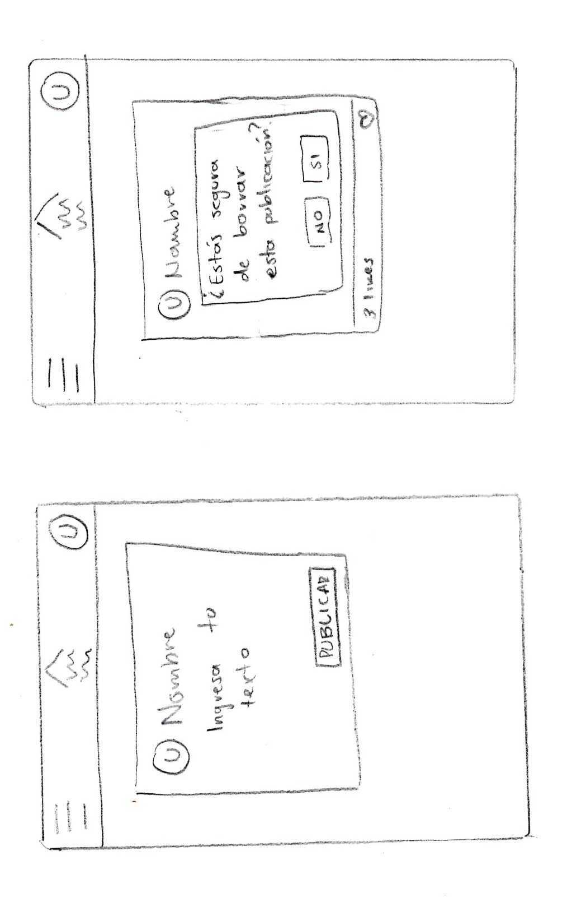

#### Versión móvil

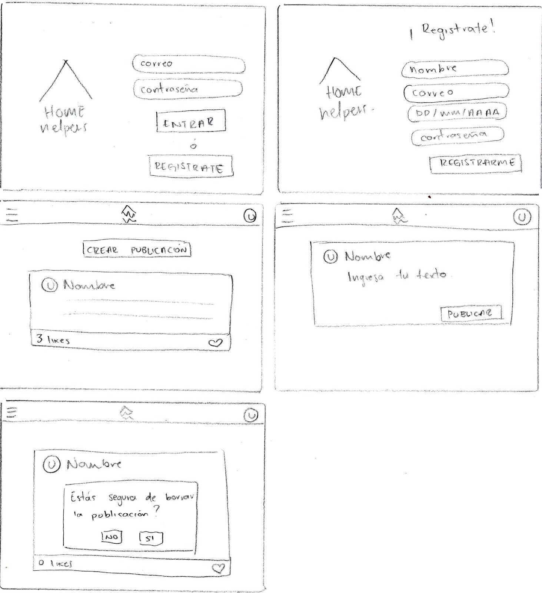

### 5.2 Logotipo y paleta de color

Se realizó desde cero el diseño del logotipo, contiene el techo de una casa representando los hogares donde se encuentran nuestras amas de casa. Y bajo ese techo está el nombre de "Home helpers", ya que este es un espacio seguro para cada una de las usuarias. 

Además la paleta de color contiene 5 colores que denotan un espacio cálido y amable. Estos colores se utilizan en toda la página. 
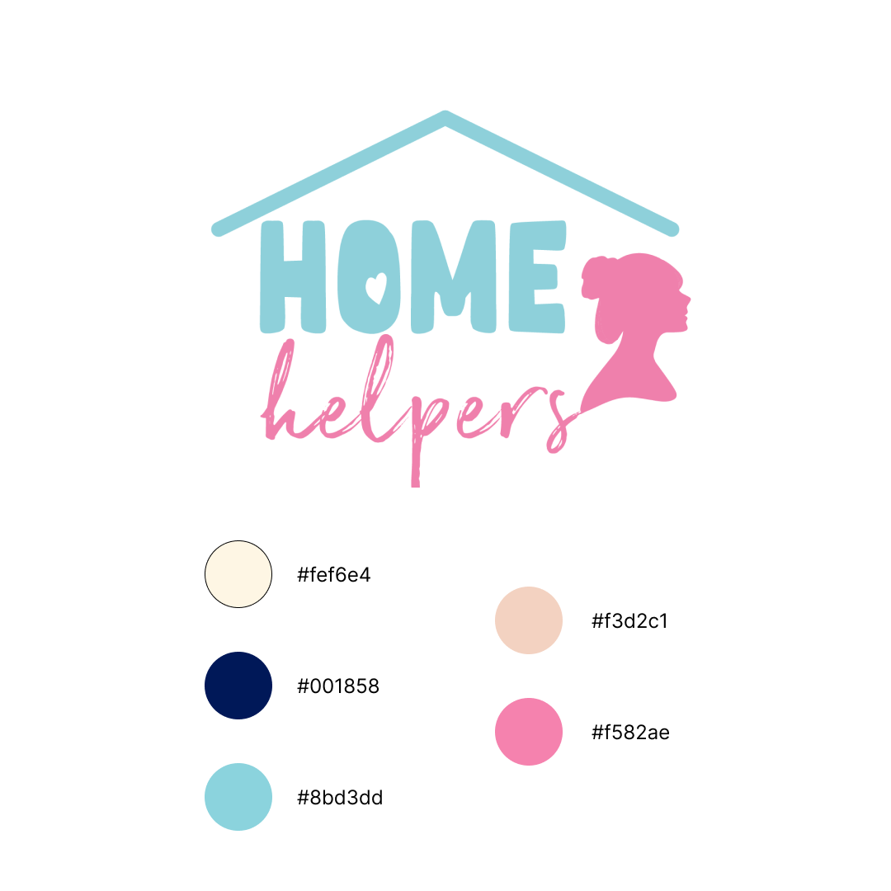

### 5.3 Prototipo de alta fidelidad

Se realizaron dos archivos en figma, uno para la versión móvil y otro para la versión web. 

## 6. Consideraciones del comportamiento de la interfaz de usuario

### 6.1 Creación de cuenta de usuario e inicio de sesión

* _Login_ con Firebase:
  [x]Para el _login_ y las publicaciones en el muro se utiliza Firebase
  [x]Creación de cuenta de acceso y autenticación con cuenta de correo y
    contraseña, y también con una cuenta de Google.
* Validaciones:
  [x]Solamente se permite el acceso a usuarios con cuentas válidas.
  [x]No pueden haber usuarios repetidos.
  []La cuenta de usuario debe ser un correo electrónico válido.
  [x]Lo que se escriba en el campo (_input_) de contraseña debe ser secreto.
* Comportamiento:
  [x]Al enviarse el formulario de registro o inicio de sesión, debe validarse.
  [x]Si hay errores, se deben mostrar mensajes descriptivos para ayudar al
  usuario a corregirlos.

### 6.2 Muro/timeline

* Validaciones:
 [x]Al publicar, se debe validar que exista contenido en el _input_.
* Comportamiento:
 [x]Al recargar la aplicación, se debe verificar si el usuario está _logueado_
    antes de mostrar contenido.
 [x]Poder publicar un _post_.
 [x]Poder dar y quitar _like_ a una publicación. Máximo uno por usuario.
 [x]Llevar un conteo de los _likes_.
 [x]Poder eliminar un post específico.
 [x]Pedir confirmación antes de eliminar un _post_.
 [x]Al dar _click_ para editar un _post_, debe cambiar el texto por un _input_
    que permita editar el texto y luego guardar los cambios.
 [x]Al guardar los cambios debe cambiar de vuelta a un texto normal pero con la
    información editada.
 [x]Al recargar la página debo de poder ver los textos editados.

## 7. Pruebas unitarias

Se realizaron un total de 15 tests, que evalúan 5 funciones del código. 
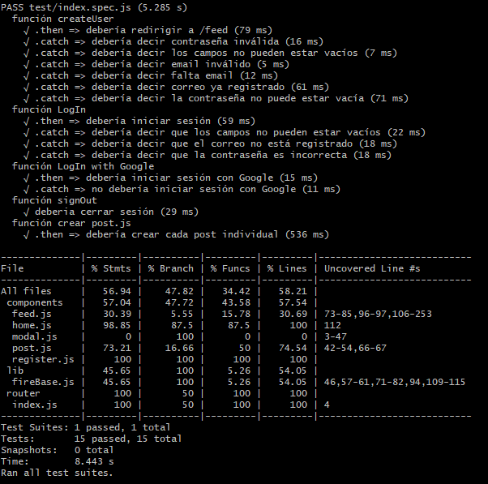

## 8. Resultado final

### 8.1 Versión móvil

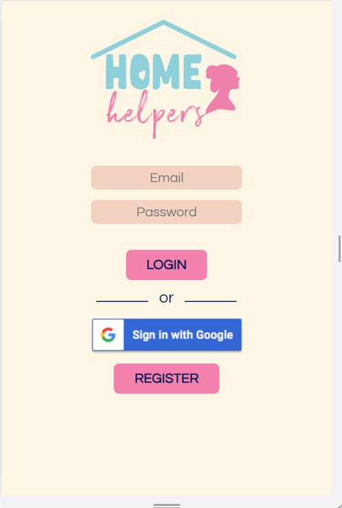
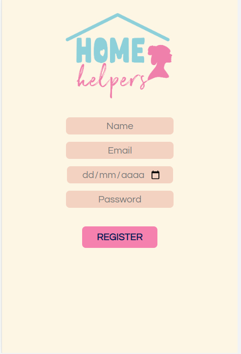
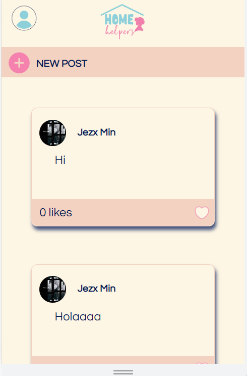
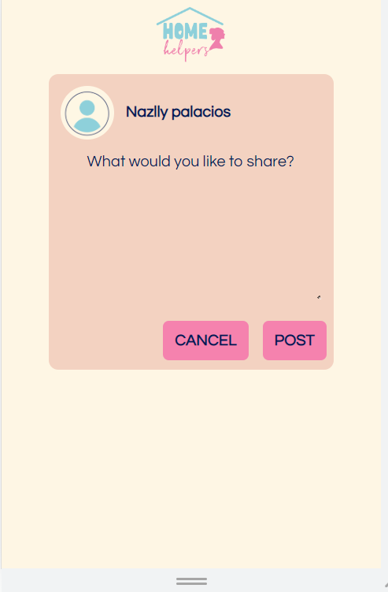
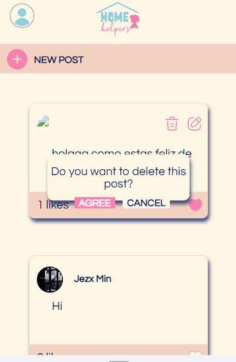
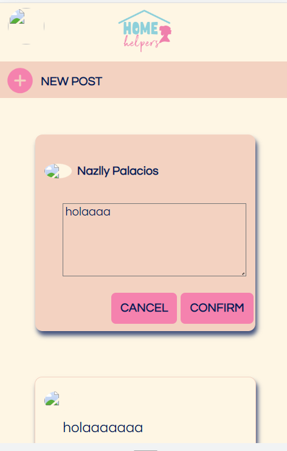

### 8.2 Versión web

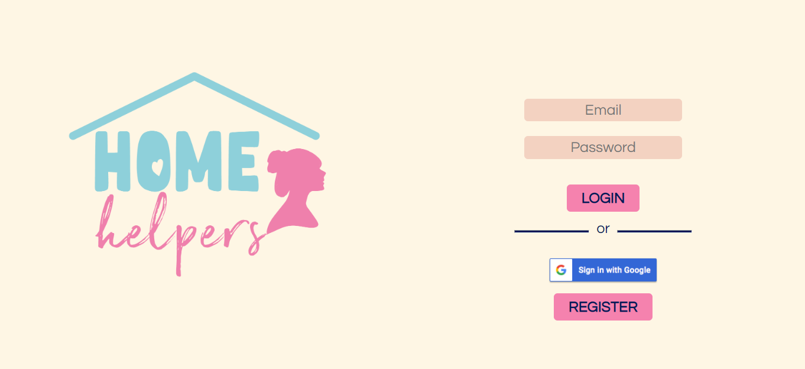
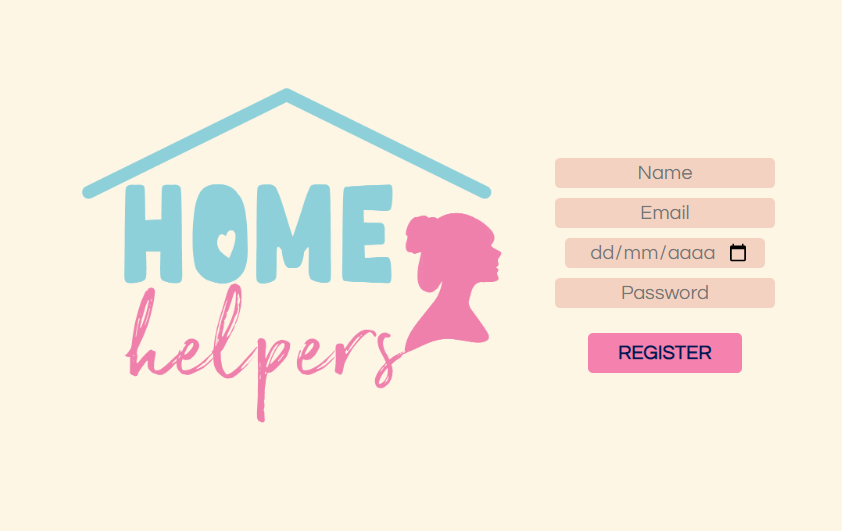

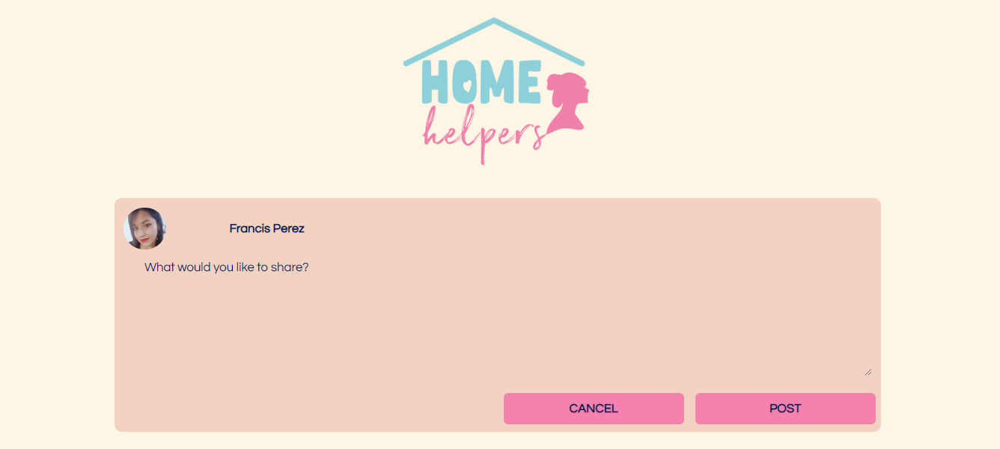
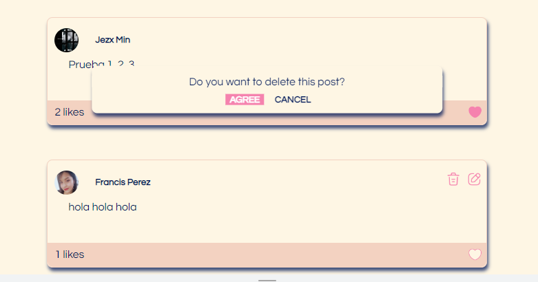
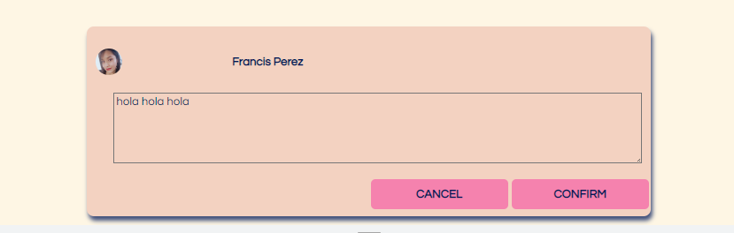
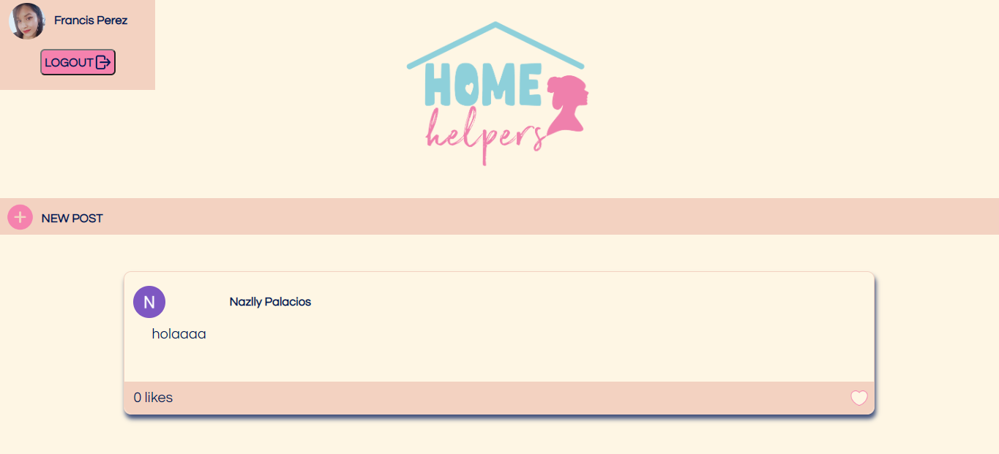

